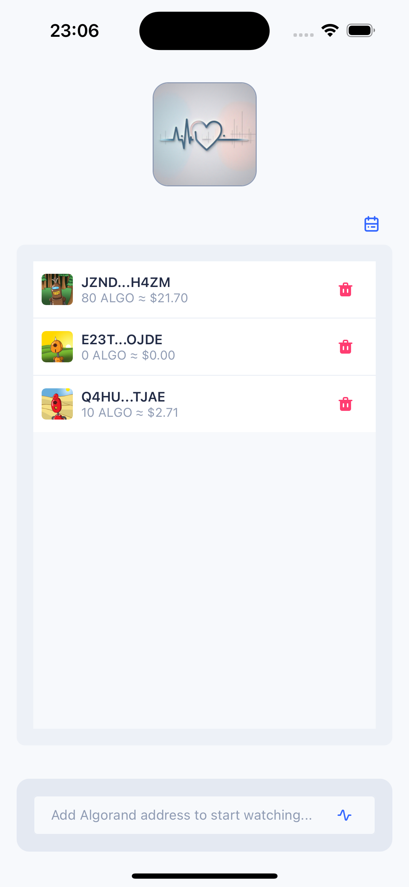
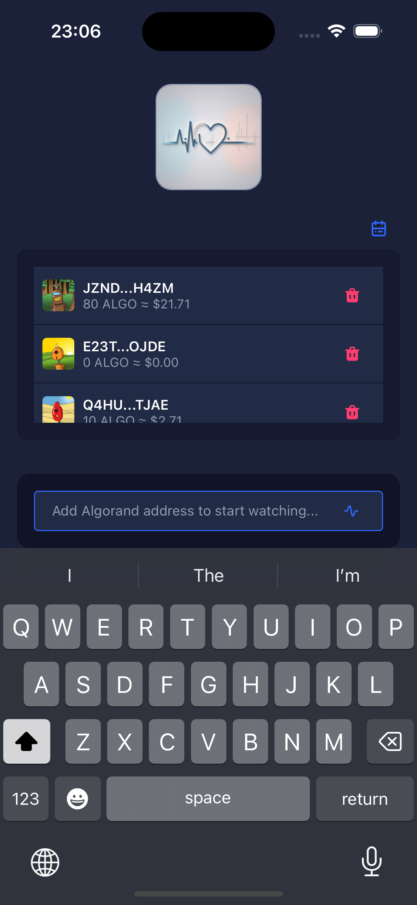

# AlgoPulse

## Project Overview

AlgoPulse is a comprehensive watcher list for Algorand addresses for the Algorand blockchain ecosystem. It provides real-time insights and wallet tracking.

## Features

- Real-time Algorand blockchain monitoring
- Comprehensive watcher list with visualizations
- Monitoring wallets address via Algorand API
- Customizable alerts: no internet connection, enter valid Algorand address, successful added algorand address, already added address
- Sort by date added and amount
- light and dark mode

## Light and dark mode.

<div style="display: flex; justify-content: space-around;">
  
  
</div>

## Project Structure

```
algo-pulse/
├── src/
│   ├── api/           # API integration and endpoints
│   ├── assets/        # Logo
│   ├── components/    # Reusable UI components
│   ├── constants/     # Constants and enums
│   ├── hooks/         # Custom React hooks
│   ├── screens/       # Application screens/pages
│   ├── store/         # State management (Redux/Context)
│   ├── types/         # TypeScript type definitions
│   └── utils/         # Utility functions and helpers
├── android/           # Android specific files
├── ios/               # iOS specific files
├── public/            # Static assets
├── .eslintrc.js       # ESLint configuration
├── .prettierrc.js     # Prettier configuration
├── babel.config.js    # Babel configuration
├── tsconfig.json      # TypeScript configuration
└── package.json       # Project dependencies and scripts
```

## Installation Instructions

1. Clone the repository:

```bash
git clone https://github.com/loekTheDreamer/algo-pulse.git
```

2. Navigate to the project directory:

```bash
cd algo-pulse
```

3. Install dependencies using yarn:

```bash
yarn install
```

4. Start the development server:

```bash
yarn start
```

## Available Scripts

In the project directory, you can run:

```bash
yarn start
```

Runs the app in development mode.

```bash
yarn test
```

Launches the test runner.

```bash
yarn lint
```

Runs ESLint to check for code quality issues.

```bash
yarn ios
```

Runs the iOS app in the iPhone 16 simulator.

```bash
yarn clear
```

Clears the React Native cache and starts the development server.

## Known Issues

We're currently experiencing some issues with UI-Kitten component testing. These issues are being actively worked on and include:

1. Inconsistent test results for UI-Kitten components
2. Difficulty mocking certain UI-Kitten behaviors
3. Challenges with snapshot testing of styled components

Our team is working on resolving these issues and improving test coverage for our UI components.

## Contributing Guidelines

We welcome contributions to AlgoPulse! Please follow these steps:

1. Fork the repository and create your branch from `main`
2. Install dependencies using `yarn install`
3. Make your changes, following our coding standards
4. Run tests and linting:
   ```bash
   yarn test
   yarn lint
   ```
5. Commit your changes with a descriptive message
6. Push your changes to your fork
7. Open a pull request to the `main` branch

Please ensure your code follows our TypeScript and ESLint rules, and include tests for new features.

## License

AlgoPulse is [MIT licensed](https://opensource.org/licenses/MIT). See the [LICENSE](https://github.com/loekTheDreamer/algo-pulse/blob/main/LICENSE) file for more information.
